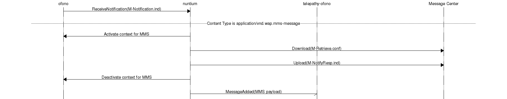
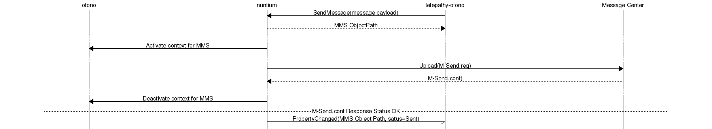

# Architecture

## Overview

`nuntium` lies in between `ofono` over the system bus and `telepathy-ofono`
over the session bus.

`nuntium` registers an agent against `ofono`'s `push notification` plugin and
sets up to receive DBus method calls from `ofono` when push messages arrive.
And it creates an instance on the session to handle method calls from
`telepathy-ofono` to send messages and signal message and service events.

### Receiving an MMS

This is a simplified scenario for an incoming message with deferral's set to
false:

### Sending an MMS

This is a simplified scenario for sending a message with message delivery set
to false:

